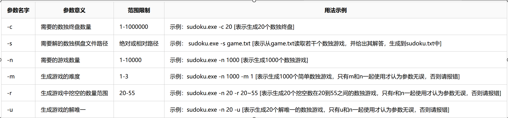

# Commandline Sudoku

## 注意事项

- 用make编译
    - 目标可执行文件是build/shudu
    - make test 直接运行可执行文件，没有参数

- sudoku.h: 数独生成和求解的一系列代码
    - Sudoku::to_string产生朴素字符串，可用于文件读写
    - Sudoku::to_pretty_string产生高可读性的字符串
    - 其余请看注释

## TODO

- generate_m和generate_u
- 解析参数
- 文件读写